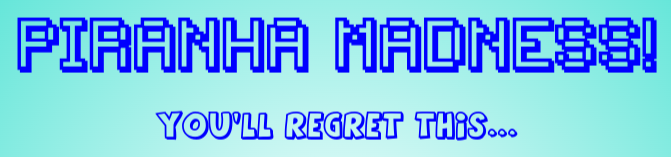
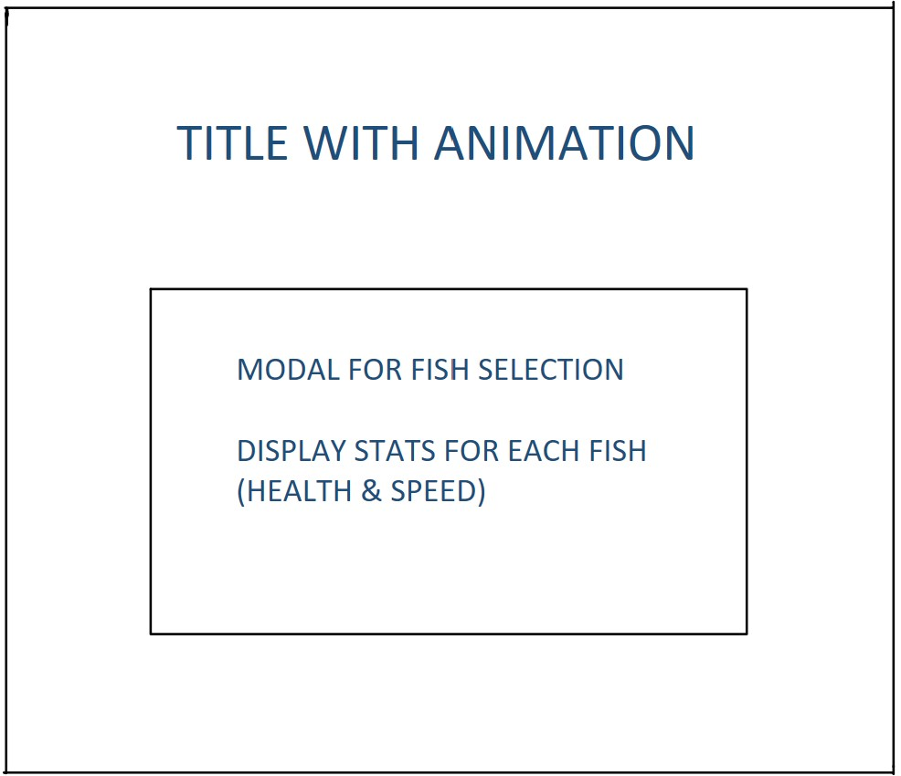
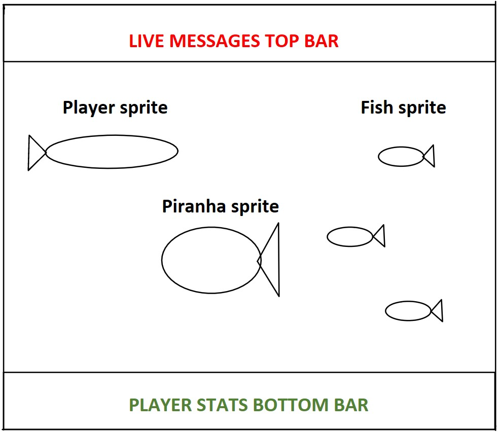
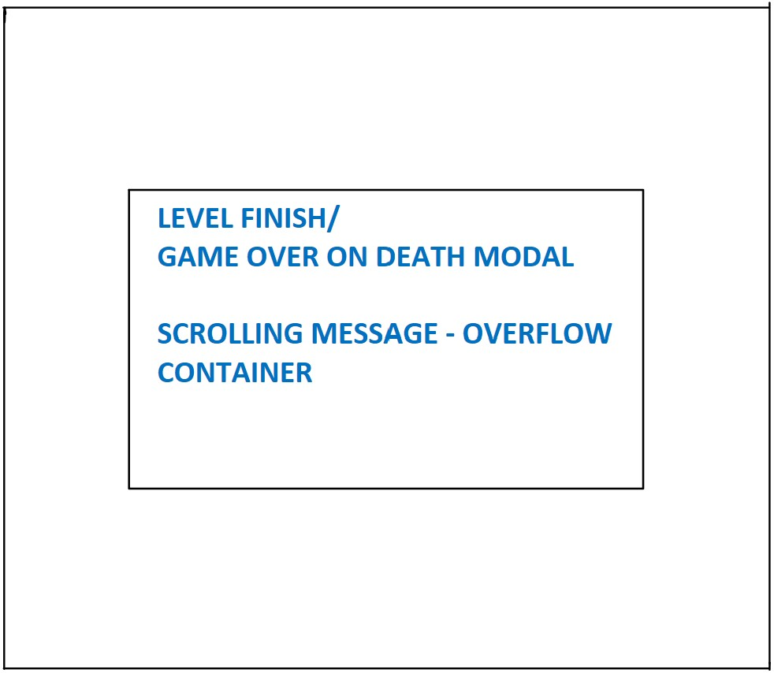
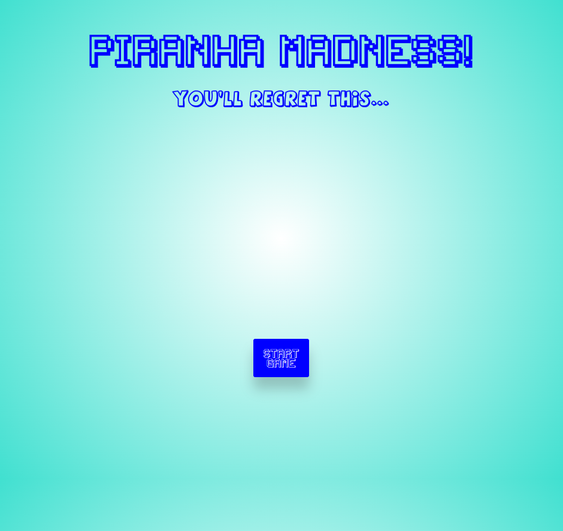
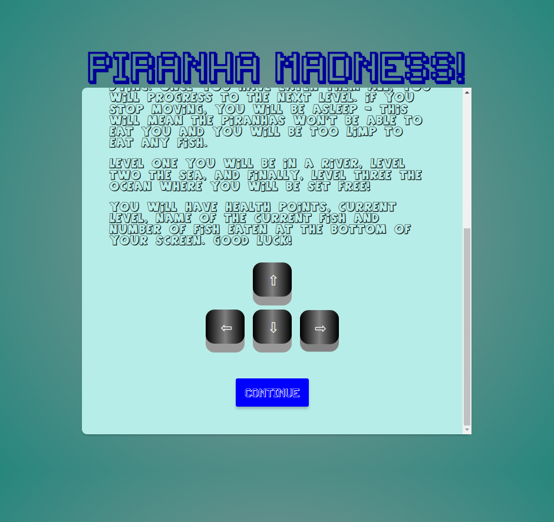
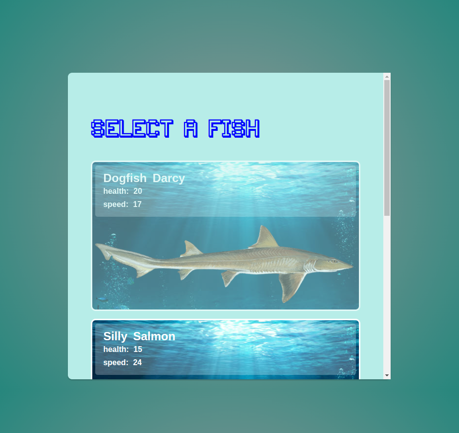
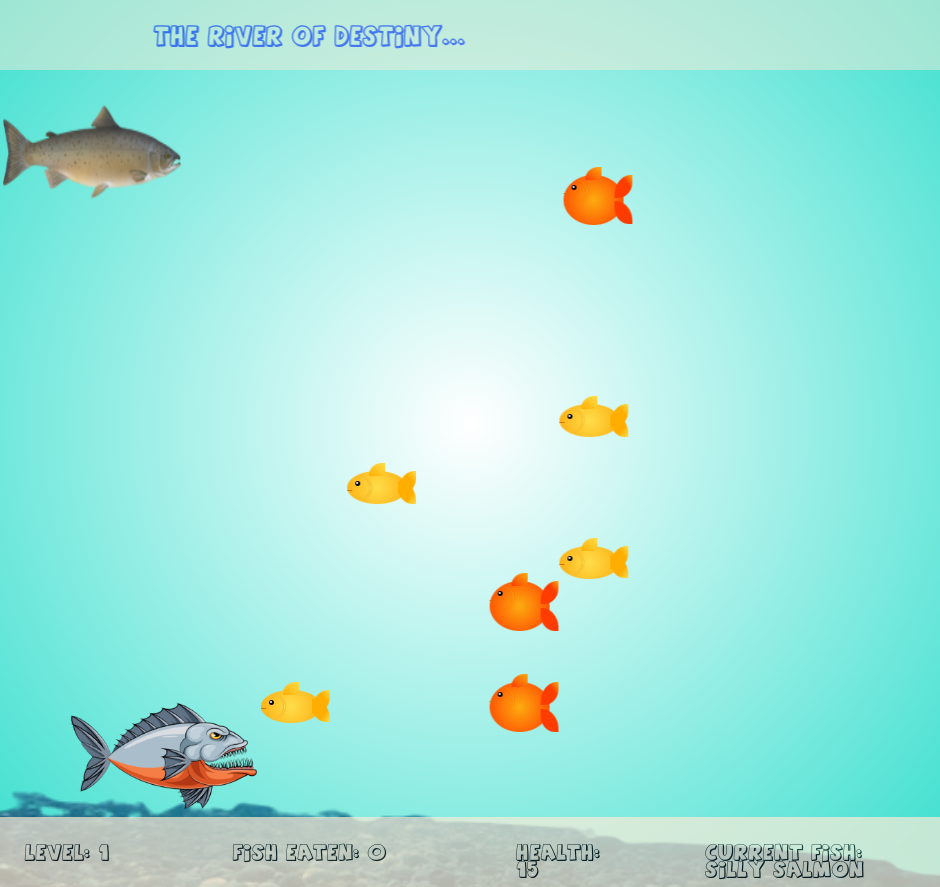

# Introduction
An arcade style game with the objective of eating all on screen fish without getting killed by a piranha. **Piranha Madness** is not like anoy other game you've played!

# Technologies Used 
* JavaScript
* CSS
* HTML

# Wireframe Planning
## Landing Page


## In game screen


## End of level/Game over modal


# Screenshots
## Landing


## Game Description Modal


## Player Selection Modal


## In Game Screen


# Getting Started & how to play
Start the game by following the link [here](https://petermc87.github.io/project_1_piranha_madness/)

Click `start game` to be brought the game description modal. Click `continue` to display the player selection modal. 

Select a fish from the 


## Game page 
* A stat bar at the bottom of the page will show the current level, health, number of fish eaten, and the name of the chosen fish
* There will be a live message bar at the top showing giving update messages, so keep and eye out for them!
* Your fish will spawn at a location on the top left of the screen
* The fish to be eaten will spawn on the right hand side of the page moving right to left and will move passed the full width of the screen. If you have not eaten a fish, it will re-appear at its original spawn position and continue to move in the same direction
 
## Gameplay
* Move around the screen using the arrow keys on your keyboard
* You have to eat all the fish on the screen without getting killed by the piranha
* The piranha will move in a pre-defined direction with varying speeds based on the piranha sprite

### Attributes 
* Each Piranha fish has speed and damage points 
* Your player fish will have hull points and speed 

### Moving to next level 
* Eat up all the dish to progress to the next level
* Each following level has an extra number of fish to be eaten. Level one is 10, level 2 is 15, and level 3 is 20
* After you have finished the third level, a final modal will pop up with a brief message


# How to game was built

## Animations  
CSS Key frame animations were used for:
* The linear movements of the food fish
* The movements of the piranhas
* The movement of the title up and down
* Roatation animation of the when it gets hit by a piranha

## Fonts
The following fonts were used throughout for consistency:
* Fonts/back-to-1982.regular.ttf - 1982
* Fonts/AGENTORANGE.TTF - agentorange

## Audio
Audio is used in the intro section, in game and ending music.
Additionally, there are audio affects for when you progress to the next level, when you get hit, when you eat a fish and when you die.


## JavaScript Functions
For detecting a clash with fish food or a piranha, getBoundingClient was used. It was set to detect a clash for all moving directions of the players sprite. 

Below shows the `.getBoundingClient()` method used to detect a collision between the player sprite (`player`) and the fish sprite (`food`).

The return section will checks the positon of each corner of both the `player` and `food` and returns true if there is a a hit.

```js
// checking if the players mouth hit a fish
const fishCollisionCheck = (food, player) => {
  const foodRect = food.getBoundingClientRect()
  const playerRect = player.getBoundingClientRect()
  return (foodRect.right >= playerRect.left && foodRect.left <= playerRect.right) &&
    (foodRect.bottom >= playerRect.top && foodRect.top <= playerRect.bottom)
}
```

A template literal was used to render all the spawned fish for each level. Each individual fish div is added into the inner HTML of the parent div for all fish.

The HTML added into the DOM for fish spawns from `app.js`

```js
    currentFish = allEatingFish.innerHTML += ` <div class="fish" id="${fish}-fish" 
            style= 
            "left: 60vw; top: ${randomHeight}vh;
            animation: fishmove ${moveTime}s linear infinite;">
            <div class="fin" id="${fish}-fin"></div>
            <div class="mouth"></div>
            <div class="eye">
                <div class="m"></div>
            </div>
            <div class="g" id="${fish}-gill"></div>
            <div class="t1" id="${fish}-tail"></div>
            <div class="t2" id="${fish}-tail"></div>
            </div>`
```

# Bugs and Technical Challenges
* You can move your player around the screen at the end of each level before hitting continue
* The piranha fish also stay moving at the end of each level, meaning you could possibly end up getting hit and die even after the level is done!
* The second piranha movement animation was an accident. It was me trying to figure out keyframes!
* You can only eat the fish while in motion. This is a consequence of eventlistener feature for the fish contact. This could be improved by finding a way for collisions to happen outside of the event listener and inside. In the end, this was something I adopting as a feature of the game, which actually is kind of fun!


<!-- 
* Wireframe for game page styling


* Wireframe for boss fight


* Wireframe for what happens when moving to next level


 -->
